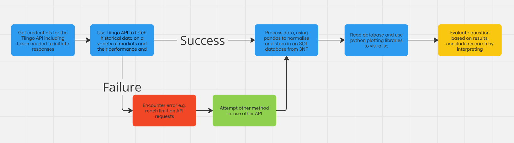
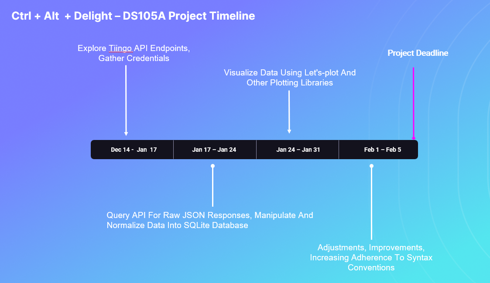

## Who We Are
1. Samuel
2. Nicholas
3. Aishik
4. Zaid

## What's Our Project?

#### API:
- Tiingo API

#### Justification: 
| Factors | Tiingo | AlphaVantage | Choice |
|----------|--------|--------------|--------|
| Request Limit (Per Day) | 1000 | 25 | Tiingo |
| Data | More Comprehensive | Less Comprehensive | Tiingo |
| Connections | IEX Exchange | Nil | Tiingo |
| Real-Time Data Availability | Available for All Instruments | Limited for Certain Instruments | Tiingo |
| Extensiveness of Data | Extensive for All Instruments | Extensiveness Depends on Specific Instrument & Timeframe | Tiingo |
| Niche Data | May Be Unavailable | May be Unavailable | Tie |
| Documentation & Developer Support | Comprehensive | Comprehensive | Tie |

**Conclusion**: Since Tiingo beat AlphaVantage for all aspects, we decided to choose Tiingo.

#### Endpoints: 
- IEX
- EOD Stock Price

#### Requirements: 
- Authentication Credentials

#### Constraints: 
- 50 Requests/Hour
- 1000 Requests/Day

#### Research Question:
How have the different industries on the financial markets performed over the last 5 years?

#### How We'll Get There:
| Steps | Execution |
|-------|-----------|
| 1 | Sign-up With Tiingo API To Get Credentials |
| 2 | Use Credentials To Receive Authentication Token To Make API Requests |
| 3 | Normalize Responses To 3NF And Select Relevant Fields |
| 4 | Store in SQLite Database |
| 5 | Read Database And Use Plotting Libraries (Matplotlib, Let's-plot) To Make Visualisation |

#### Work Distribution:
| Name | Role |
|------|------|
| Samuel | Data Collection -> Gather Credentials And Access Token To Query Tiingo API For JSONL Responses |
| Nicholas & Aishik | Data Manipulation -> Use Pandas to Create Normalize DataFrames and Save Them To A SQLite Database |
| Zaid | Data Visualisation -> Use Refined Data To Plot and Visualise Data |

#### Constraints:
1. Limited API Requests -> Will Structure Requests To Maximise Use 
2. Multiple Endpoints Increase Complexity And Processing Times -> Reduce Data Redundancy 
3. Have Never Used Tiingo, May Be Difficult To Utilize -> Practice Over Break, Alternative API (AlphaVantage)
4. Free version of Tiingo API only allows **50 requests per hour** and **1000 requests per day**
5. Tiingo API only has 5 years worth of historical data, making it hard to extrapolate long-term trends 
6. Due to the excessive volume of data we have to collect, we foresee an issue regarding the upper threshold of git commits for databases (100MB) for our SQL database, so we must remember to use gitLFS
7. Loading time could potentially take a long time due to the sheer volume of data we would collect

#### Risk Mitigation & Back-Up Plans:
1. Exceeding Data Request Limit: We May Exceed The 50 Limit Per Hour Requests Limit
    - Optimize API calls by bundling multiple queries into a single request when supported
2. Data Accuracy: Data Provided May Be Inaccurate Or Outdated Due To Errors in Tiingo's Sources Or Delays
    - Double-check data With Other Sources Like Yahoo Finance
3. API Downtime/Outages: The API may go down for maintenance/improvements
    - Use An Exponential Back-Off Strategy Where We Retry At Increasing Time Intervals

## Project Planning & Research Design

1. From 6 Dec 2024 to 6 Jan 2024
    - Set up Tiingo accounts with personal authentication token (Each group member would do so)
    - Explore potential endpoints to use
        - End-of-Day Endpoint
        - News Endpoint
    - Since we are using individual stocks to build our own ETF, we will be using this endpoint: Historical Intraday Prices Endpoint for International Exchange (IEX)
    - Determine the potential timeframe to study (Max of 5 years)
2. From 6 Jan 2025 to 20 Jan 2025
    - Getting JSONL files
    - Process JSONL files (Normalize and Explode)
    - Store the cleaned data into a SQL Database
    - Establish necessary primary & foreign key (composite key if necessary)
3. From 20 Jan 2025 to 1 Feb 2025
    - Engaging in data visualisation of the data present in the SQL database
    - Determine the types of data visualisation to use
        - Line graphs to determine trends across time
        - Pie charts to determine weightage of each industry
        - Use historical data to determine potential return of our ETF
        - Lastly, draw conclusions about ETF and our overall data analysis
4. From 1 Feb 2025 to 8 Feb 2025
    - Engage in minor changes and bug fixes
    - Amend conclusion if necessary
